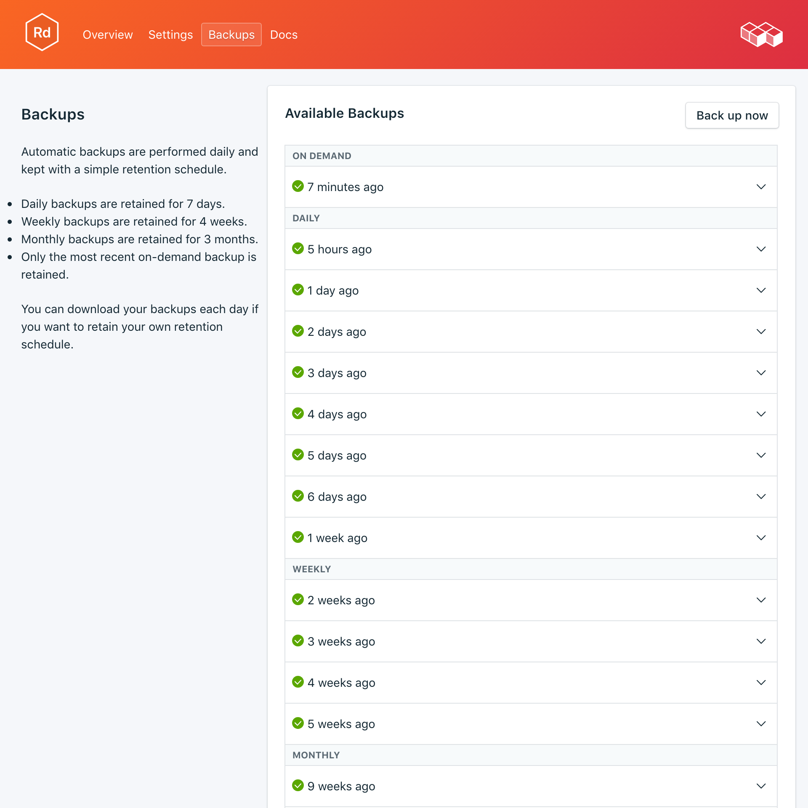
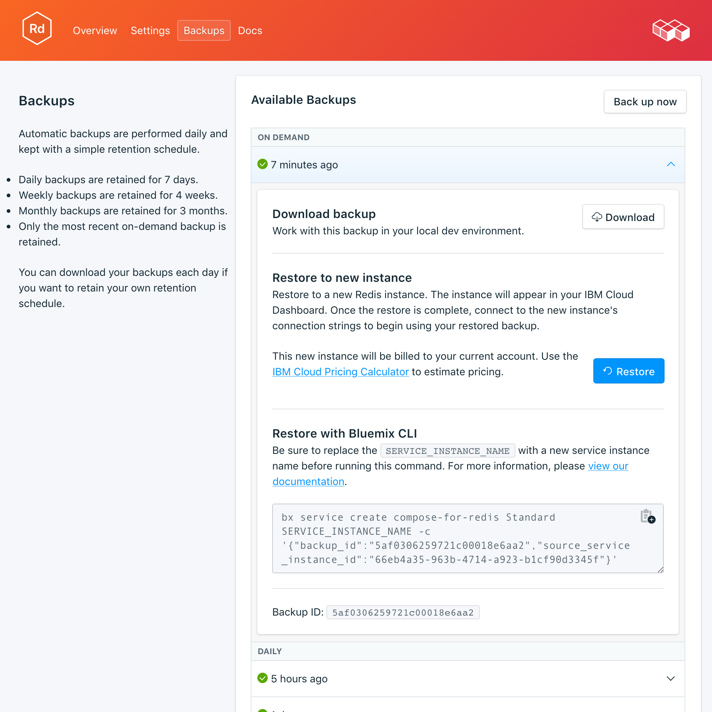

---

copyright:
  years: 2017,2018
lastupdated: "2018-03-02"
---

{:new_window: target="_blank"}
{:shortdesc: .shortdesc}
{:screen: .screen}
{:codeblock: .codeblock}
{:pre: .pre}

# 备份
{: #backups}

您可以从服务仪表板_管理_页面的_备份_选项卡创建和下载备份。有每日、每周、每月和按需备份可用。备份按照以下安排保留：

备份类型|保留安排
----------|-----------
每日|每日备份保留 7 天
每周|每周备份保留 4 周
每月|每月备份保留 3 个月
按需|保留一个按需备份。保留的备份始终是最新的按需备份。
{: caption="表 1. 备份保留安排" caption-side="top"}

备份安排和保留策略已经过修订。如果需要保留的备份数多于保留安排允许的量，那么应该根据业务需求下载备份并保留归档。

## 查看现有备份

数据库的每日备份会自动安排。要查看现有备份，请浏览至服务仪表板的*管理*页面。 

  

单击相应的行以展开任何可用备份的选项。

   

### 使用 API 查看现有备份

`GET /2016-07/deployments/:id/backups` 端点提供了备份列表。这将在服务的_概述_中显示基础端点以及服务实例标识和部署标识。例如： 
``` 
https://composebroker-dashboard-public.mybluemix.net/api/2016-07/instances/$INSTANCE_ID/deployments/$DEPLOYMENT_ID/backups
```  

## 随需应变创建备份

除了已安排的备份，您还可以手动创建备份。要创建手动备份，请浏览至服务仪表板的*管理*页面，然后单击*立即备份*。

### 使用 API 创建备份

向备份端点发送 POST 请求以启动手动备份：`POST /2016-07/deployments/:id/backups`。该请求在运行时会立即返回诀窍标识以及有关备份的信息。您必须检查备份端点以查看备份是否已完成，并在使用前查找其 backup_id。请使用 `GET /2016-07/deployments/:id/backups/`。

## 下载备份

要下载备份，请浏览至服务仪表板的*管理*页面，然后单击要下载的备份相应行中的*下载*。

### 使用 API 下载备份

在服务的_备份_页面上查找要从其复原的备份并复制 backup_id，或者通过 Compose API 使用 `GET /2016-07/deployments/:id/backups` 来查找备份及其 backup_id。然后，使用 backup_id 来查找特定备份的信息和下载链接：`GET /2016-07/deployments/:id/backups/:backup_id`。

## 备份内容

缺省情况下，Redis 保存数据的二进制快照。然后，dump.rdb 文件可以用作备份以进行时间点恢复。要生成快照 Redis 派生，请在父进程继续正常处理数据时完成子进程的所有快照工作。备份进程不会影响应用程序或数据库。您可以下载备份副本，也可以将备份直接复原到新部署中。

## 将备份与本地数据库配合使用

您可以使用 {{site.data.keyword.composeForRedis}} 备份来运行数据库的本地副本。

1. 将 dump.rdb 文件移至其自己的目录中，例如“db”。
2. 我们需要 Redis 配置文件来启动 Redis 实例，因此您希望使用 dump.rdb 文件将安装中的 redis.conf 文件复制到您的 db 目录中。例如，如果您已使用 homebrew 在 OSX 上安装 Redis，那么 redis.conf 文件位于 `/usr/local/etc`，因此请从 db 目录运行 `cp /usr/local/etc/redis.conf`。
3. 编辑配置文件以在启动时指向当前目录。使用文本编辑器打开 redis.conf 并将行 `dir /usr/local/var/db/redis/` 更改为 `dir .`。保存此文件并退出。
4. 在提供配置文件的 db 目录中启动 redis 服务器：`redis-server redis.conf`。

## 复原备份

要将备份复原到新服务实例，请执行以下步骤以查看现有备份，然后单击相应的行以展开要下载的备份的选项。单击**复原**按钮。此时将显示一条消息，通知您已启动复原。新服务实例将自动命名为“redis-restore-[timestamp]”，并在供应启动时显示在仪表板上。

### 通过 {{site.data.keyword.cloud_notm}} CLI 复原

通过 {{site.data.keyword.cloud_notm}} CLI，使用以下步骤将备份从正在运行的 Redis 服务复原到新的 Redis 服务。 
1. 如果需要，请[下载并安装 IBM Cloud CLI](https://console.{DomainName}/docs/cli/index.html#overview)。 
2. 在服务的_备份_页面上查找要从其复原的备份，然后复制备份标识。  
  **或者**  
通过 Compose API，使用 `GET /2016-07/deployments/:id/backups` 来查找备份及其标识。这将在服务的_概述_中显示基础端点和服务实例标识。例如： 
  ``` 
  https://composebroker-dashboard-public.mybluemix.net/api/2016-07/instances/$INSTANCE_ID/deployments/$DEPLOYMENT_ID/backups
  ```  
响应将包含该服务实例的所有可用备份的列表。选取要从其复原的备份并复制其标识。

3. 使用相应的帐户和凭证登录。`ibmcloud login`（或 `ibmcloud login -help` 以查看所有登录选项）。

4. 切换到您的组织和空间：`ibmcloud target -o "$YOUR_ORG" -s "YOUR_SPACE"`

5. 使用 `service create` 命令以供应新服务，并提供要在 JSON 对象中复原的源服务和特定备份。例如：
``` 
ibmcloud service create SERVICE PLAN SERVICE_INSTANCE_NAME -c '{"source_service_instance_id": "$SERVICE_INSTANCE_ID", "backup_id": "$BACKUP_ID" }'
```
_SERVICE_ 字段应该为 compose-for-redis，_PLAN_ 字段应该为 Standard 或 Enterprise（取决于环境）。_SERVICE\_INSTANCE\_NAME_ 是放置新服务的名称的位置。_source\_service\_instance\_id_ 是备份源的服务实例标识；可通过运行 `ibmcloud cf service DISPLAY_NAME --guid` 获取该值，其中 _DISPLAY\_NAME_ 是备份源自的 Redis 服务的名称。 
  
  企业用户还需要在 JSON 对象中使用 `"cluster_id": "$CLUSTER_ID"` 参数指定要部署到的集群。
  
### 迁移到新版本

某些主版本升级在当前正在运行的部署中不可用。您将需要供应运行已升级版本的新服务，然后使用备份将数据迁移到其中。此过程与上面的复原备份相同，但将指定要升级到的版本。

``` 
ibmcloud service create SERVICE PLAN SERVICE_INSTANCE_NAME -c '{"source_service_instance_id": "$SERVICE_INSTANCE_ID", "backup_id": ""$BACKUP_ID", "db_version":"$VERSION_NUMBER" }'
```

例如，将较旧版本的 {{site.data.keyword.composeForRedis}} 服务复原到运行 Redis 4.0.6 的新服务类似于以下示例：
```
ibmcloud service create compose-for-redis Standard migrated_redis -c '{ "source_service_instance_id": "0269e284-dcac-4618-89a7-f79e3f1cea6a", "backup_id":"5a96d8a7e16c090018884566", "db_version":"4.0.6"  }'

